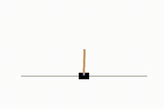
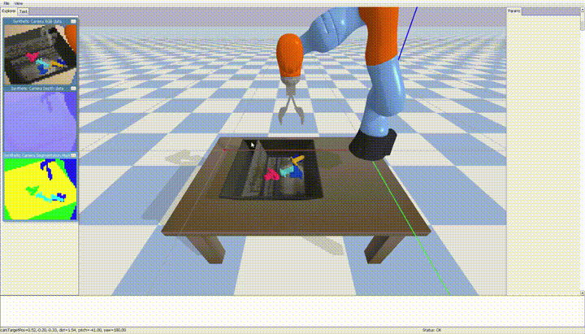

# rl

Implementations of reinforcement learning examples

## References

- [PyTorch tutorial](https://pytorch.org/tutorials/intermediate/reinforcement_q_learning.html)
- [kuka-rl](https://github.com/mahyaret/kuka_rl)

## Dependencies (tested)

- Windows 10
  - GPU Driver 471.11
  - CUDA 11.1
- Ubuntu 18.04
  - GPU Driver 470.57
  - CUDA 11.0
- Python 3.7.3
  - gym 0.21.0
  - numpy 1.21.5
  - ipython 7.4.0
  - pyglet 1.5.21
  - matplotlib 3.1.1
  - torch 1.9.1 
  - torchvision 0.10.1
  - torchaudio 0.9.1
  - pybullet 3.2.0
  - tensorboardX 2.4.1

## Installation

    $ git clone git@github.com:takuya-ki/rl.git; cd rl
    $ pip install -r requirements.txt

## Usage

    $ python cartpole/cartpole_qrl.py
    $ python cartpole/cartpole_dqrl.py

    $ python robot/train_kuka_grasp.py
    $ python robot/eval_kuka_grasp.py

## Author / Contributor

[Takuya Kiyokawa](https://takuya-ki.github.io/)  

## LICENSE

This software is released under the MIT License, see [LICENSE](./LICENSE).  
This software includes the work that is distributed in the [Apache License 2.0](https://www.apache.org/licenses/LICENSE-2.0).
